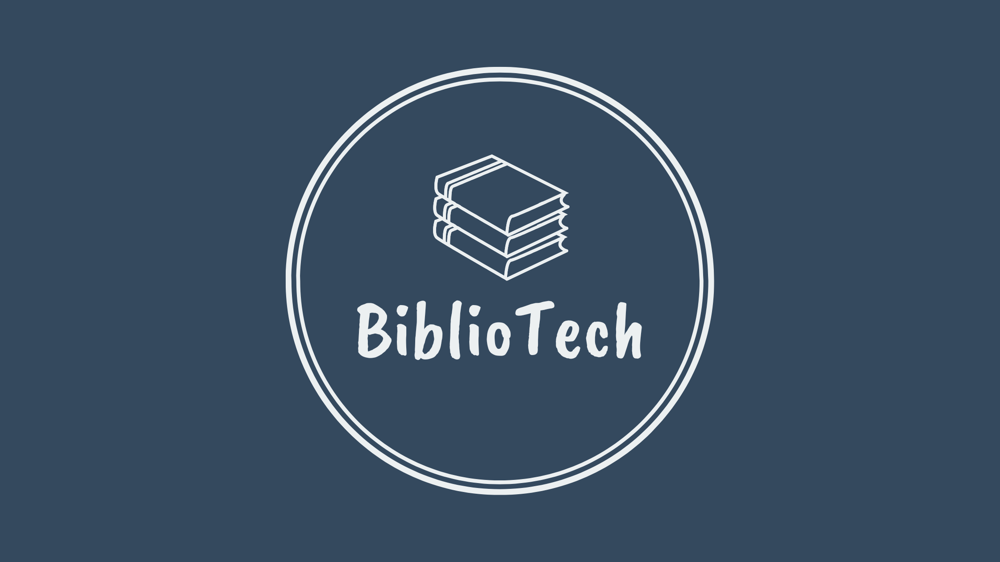

<p align="center">
  
</p>
<hr>

<h1 align="center">
    📚 <a href="#" alt="Sistema bibliotecário"> BiblioTech | Plataforma de Publicação de Ebooks  </a>
</h1>

<h3 align="center">🔖 
Plataforma para escritores independentes publicarem e distribuírem seus ebooks, permitindo que leitores descubram, baixem e acompanhem novas obras de forma simples e segura.

</h3>

<p align="center">
        
        
        
        
        <a href="https://github.com/Lamarkes/spring-library/commits/main">
        
        </a>
        
</p>

<h3 align="center"> 
	🚧  BiblioTech 📘 Em construção...  🚧
</h3>

<h2>📝 Índice</h2>

* [Sobre o Projeto](#-sobre-o-projeto)
* [Objetivos](#-objetivos)
* [Como Usar](#-como-usar)
    * [Pré-Requisitos](#pré-requisitos)
    * [Rodando o Backend](#rodando-o-backend)
* [Tecnologias](#tecnologias)
     * [Back-end](#back-end)
     * [Banco de dados](#banco-de-dados)
     * [Testes](#testes)
     * [Utilitários](#utilitários)
* [Documentação](#documentação)
     * [Swagger](#inicialização-do-swagger)
* [Ferramentas](#ferramentas)
* [Funcionalidades](#-funcionalidades)
     * [Livros](#livros)
     * [Usuários](#usuários-em-breve)
* [Arquitetura](#-arquitetura)
* [Autor](#autor)
* [Entre em contato](#entre-em-contato)
* [Licença](#-licença)


## 💻 Sobre o Projeto

BiblioTech - Uma plataforma web desenvolvida para aproximar escritores independentes de seus leitores. A aplicação permite que autores publiquem ebooks digitais, organizem suas obras e as disponibilizem para download, enquanto leitores podem descobrir novos títulos, criar suas bibliotecas pessoais e acompanhar seus autores favoritos.

O BiblioTech foi desenvolvido como um projeto de portfólio com o objetivo de aplicar conceitos modernos de desenvolvimento backend, arquitetura de microsserviços, segurança, mensageria e computação em nuvem.

Além das funcionalidades da plataforma, o projeto busca seguir boas práticas de engenharia de software, desde a modelagem da aplicação até sua implantação em ambiente de produção.

## 🎯 Objetivos

O BiblioTech busca fornecer uma plataforma simples para publicação de ebooks por escritores independentes, permitindo que leitores encontrem novas obras e construam sua biblioteca digital.

Além da proposta funcional, o projeto também demonstra a utilização de tecnologias modernas amplamente utilizadas no mercado.

Um dos principais objetivos do BiblioTech é facilitar a publicação e compartilhamento de obras. Por isso, a plataforma tem foco em tornar a busca por ebooks mais eficiente, disponibilizando de vários métodos de pesquisa por títulos.

## 🚀 Como usar
Este projeto atualmente é composto apenas por 1 pasta:
1. Backend (pasta books)
   
### Pré-requisitos

 Antes de iniciar o projeto, certifique-se de possuir instalado:

- Java 21
- Maven
- MySQL
- Git
- Docker
- IntelliJ IDEA ou VS Code
- Postman
  
#### Rodando o Backend
```shell
# Clone este repositório:

git clone https://github.com/Lamarkes/BiblioTech.git

# Navegue até o diretório do projeto:

cd BiblioTech

# Instale as dependências:

mvn clean install 

# Inicie o servidor:

 mvn spring-boot:run 

```

**Apos inicializar o servidor, acesse a pagina de documentação do Swagger para testar as rotas da API** 

[Documentação](#documentação)

### Tecnologias

As seguintes ferramentas foram usadas na construção do projeto:

#### Back-End
- [Java](https://www.oracle.com/br/java/)
- [Spring Framework](https://spring.io/)
- [Maven](https://maven.apache.org/)
- [Spring Data JPA](https://spring.io/projects/spring-data-jpa)
- [Hibernate](https://hibernate.org/)
- [Flyway](https://github.com/flyway/flyway)

#### Banco de dados
- [MySQL](https://www.mysql.com/)
- [H2 DATABASE](https://h2database.com/html/quickstart.html)

#### Testes

- [H2 Database](https://www.h2database.com)
- [JUnit](https://junit.org/junit5/)
- [Mockito](https://site.mockito.org/)

### Documentação:

O projeto contém a documentação da API por meio do Swagger, que pode ser acessada durante a execução do projeto.

- [Swagger](https://swagger.io/)

  #### Inicialização do Swagger:
  Ao inicializar o projeto, é possivel acessar a documentação dos endpoints e testa-los de maneira dinâmica: 

  - [Página do Swagger](http://localhost:8084/swagger-ui/index.html)

### Ferramentas:

As seguintes ferramentas foram utilizadas para desenvolver a API do sistema:

- [Docker](https://www.docker.com/)
- [Git](https://git-scm.com/)
- [Postman](https://www.postman.com/)

## 🛠 Funcionalidades

A seguir, estão as funcionalidades presentes na API, além das futuras funcionalidades que estão em fase de planejamento.

#### Livros

- Publicação de ebooks
- Atualização dos ebooks
- Remoção de ebooks
- Pesquisa por título
- Pesquisa por autor
- Pesquisa por categoria

#### Usuários (*EM BREVE*)
- Cadastro
- Login
- Autenticação JWT
- Controle de permissões (Leitor e Escritor)
- Atualização de perfil

## 🏗 Arquitetura

O projeto será desenvolvido utilizando arquitetura baseada em microsserviços.

O projeto está planejado em três serviços principais:

- 📚 Book Service (Atual)
- 👤 User Service
- 📧 Email Service

A comunicação entre os serviços será realizada através de APIs REST e mensageria utilizando RabbitMQ.

## Autor
<sub><b>Lamark Ricarte</b></sub>🚀

Feito com ❤️ por Lamark Ricarte. 

## Entre em contato

[](https://www.linkedin.com/in/lamarkricarte/) 
[](mailto:lamark12ricarte@gmail.com)


## 📝 Licença

Este projeto esta sobe a licença [MIT](./LICENSE).